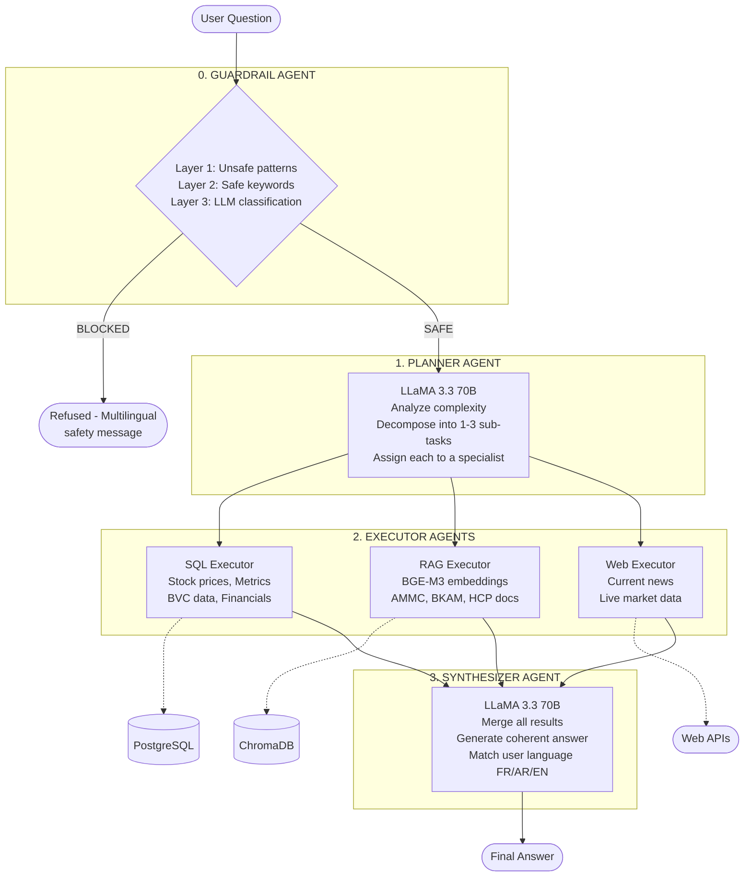

# Multi-Agent Architecture: Plan-and-Execute

```mermaid
flowchart TD
    USER([User Question]) --> GUARD

    subgraph GUARD_BOX["0. GUARDRAIL AGENT"]
        GUARD{Layer 1: Unsafe patterns<br/>Layer 2: Safe keywords<br/>Layer 3: LLM classification}
    end

    GUARD -->|"BLOCKED"| BLOCKED([Refused - Multilingual<br/>safety message])
    GUARD -->|"SAFE"| PLANNER

    subgraph PLAN["1. PLANNER AGENT"]
        PLANNER[LLaMA 3.3 70B<br/>Analyze complexity<br/>Decompose into 1-3 sub-tasks<br/>Assign each to a specialist]
    end

    PLANNER --> SQL_EXEC
    PLANNER --> RAG_EXEC
    PLANNER --> WEB_EXEC

    subgraph EXEC["2. EXECUTOR AGENTS"]
        SQL_EXEC[SQL Executor<br/>Stock prices, Metrics<br/>BVC data, Financials]
        RAG_EXEC[RAG Executor<br/>BGE-M3 embeddings<br/>AMMC, BKAM, HCP docs]
        WEB_EXEC[Web Executor<br/>Current news<br/>Live market data]
    end

    SQL_EXEC -.-> PG[(PostgreSQL)]
    RAG_EXEC -.-> CHROMA[(ChromaDB)]
    WEB_EXEC -.-> WEB_API([Web APIs])

    SQL_EXEC --> SYNTH
    RAG_EXEC --> SYNTH
    WEB_EXEC --> SYNTH

    subgraph SYNTH_BOX["3. SYNTHESIZER AGENT"]
        SYNTH[LLaMA 3.3 70B<br/>Merge all results<br/>Generate coherent answer<br/>Match user language FR/AR/EN]
    end

    SYNTH --> ANSWER([Final Answer])
```
